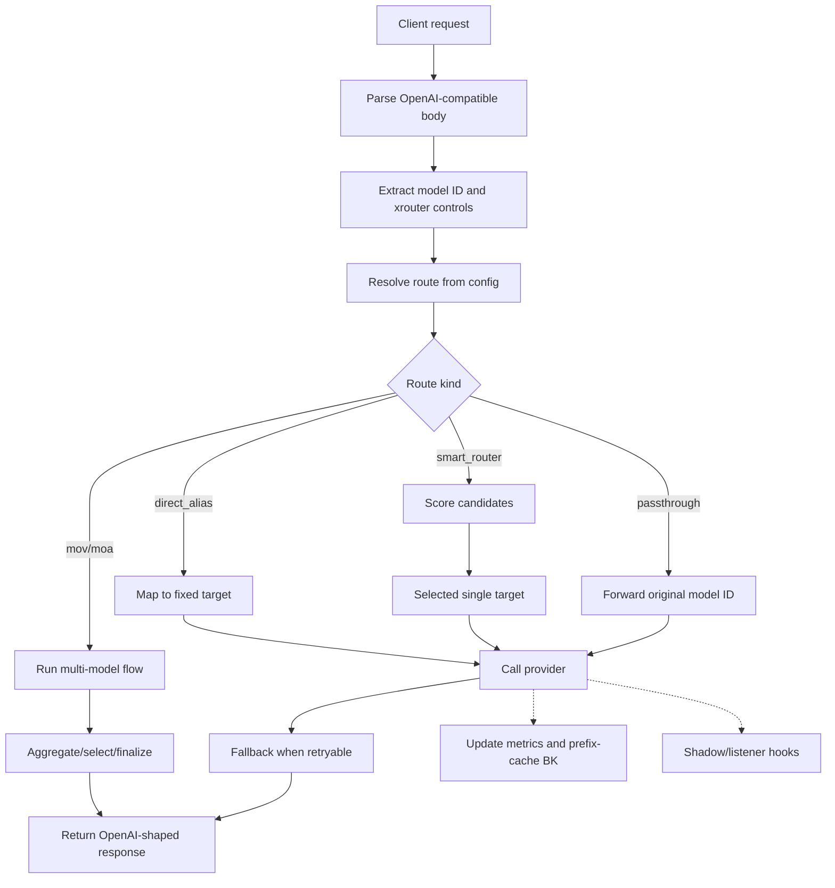

# XRouter Architecture

## Goal

XRouter is a single-Go OpenAI-compatible routing layer. It lets clients keep using OpenAI-style requests while XRouter decides how to dispatch the request to upstream providers.

The product is intentionally infrastructure-oriented:

- no vendor lock-in in the northbound API
- provider abstraction on the southbound side
- model ID as strategy selector
- explicit distinction between single-model routing and multi-model orchestration
- route decisions controlled by config, with request-level overrides when allowed

## Request lifecycle



## Core components

| Component | Responsibility |
|---|---|
| Go HTTP server | Exposes `/v1/chat/completions`, `/v1/responses`, `/v1/models`, health, metrics, and optional debug endpoints. |
| Strategy resolver | Converts request `model` into a configured route. Exact match wins over prefix match. |
| Provider client | Sends OpenAI-compatible requests to OpenAI, OpenRouter, or custom providers. |
| Smart router | Hard-filters candidates, then scores and selects one target. |
| Prefix-cache BK | Tracks prefix-hash affinity per target to improve repeated-prefix locality. |
| Judge router | Optional small-model route selector; it chooses target, not final answer. |
| MoV executor | Executes multi-model orchestration flows. |
| Metrics store | Tracks count, latency, and status by route/target. |
| Sticky store | Keeps session-to-target affinity when enabled. |

## Model ID dispatch

The incoming `model` field can be:

1. a virtual route ID, such as `xrouter/auto`
2. a direct alias, such as `gpt-4o-mini`
3. a prefix route, such as `xrouter/code/go`
4. a configured target ID, used directly as a single-target route
5. an unknown upstream model ID, handled by `unknown_model_policy`

Dispatch order:

```text
1. exact route match
2. configured prefix match
3. wildcard route name ending in '*'
4. configured target ID
5. default route
6. unknown model policy
```

Exact match always wins over prefix match. This prevents broad prefixes from accidentally hijacking fixed aliases.
Configured target IDs are resolved before `routing.default_route`, so every target advertised by `/v1/models` remains directly reachable.

Unknown model passthrough is controlled only by `unknown_model_policy`. The resolver does not infer provider choice from whether a model ID contains `/`.

## Direct alias invariant

A `direct_alias` route must not rewrite messages, tools, tool choice, response format, or generation parameters. It only changes the upstream target/model mapping and removes XRouter-private fields before forwarding.

## Responses API handling

For `/v1/responses`:

- If the selected target supports native `/responses`, XRouter forwards to `/responses`.
- If the target only supports chat completions, XRouter maps common text fields into `/chat/completions` and wraps the result in a Responses-shaped object.

The shim covers the common text path. It does not pretend to implement full server-side conversation state.

Chat Completions `tool_calls` are preserved as Responses-style `function_call` output items when the shim is used.
