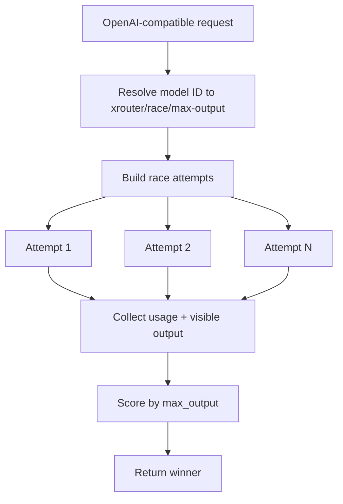
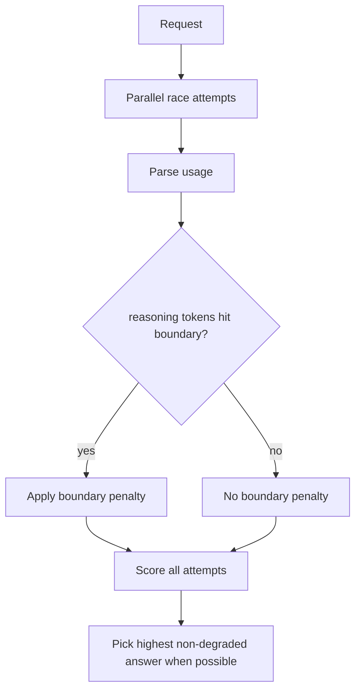
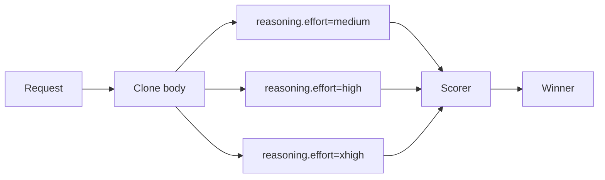
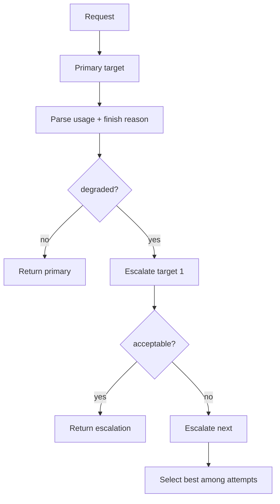
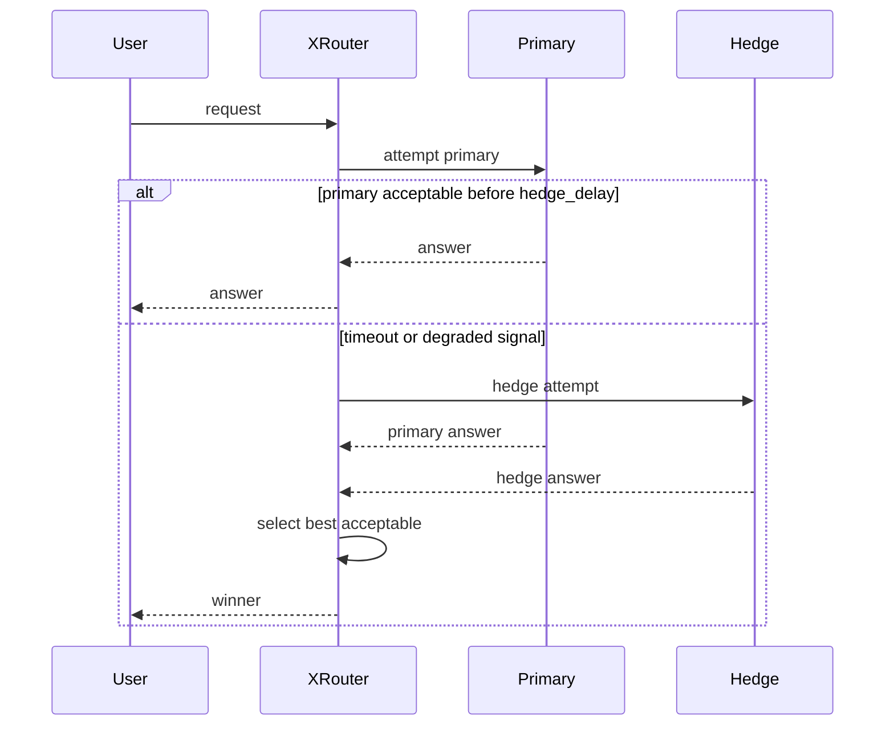
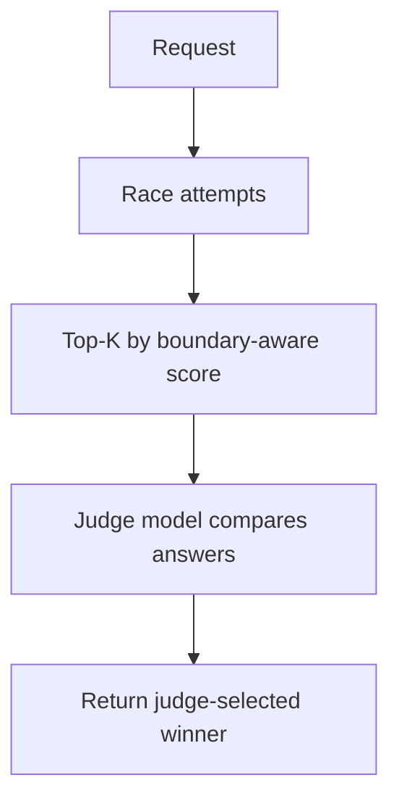

# XRouter Degradation Guard and Race Strategies

## 1. 背景和边界

外部用户观测到部分 Codex / reasoning 模型的 `reasoning_output_tokens` 在 `516 / 1034 / 1552 / ...` 附近出现聚集。XRouter 不能证明这是上游主动降质、截断或调度分层；XRouter 只能把它当成一种**可观测的风险信号**。

XRouter v5 的设计目标不是“破解上游”，而是做一个更鲁棒的路由层：

```text
当某次请求疑似落入低预算 / 固定边界 / incomplete / 过短输出时，
可以自动用并行或串行策略再跑一次或多次，
然后按可配置评分选择最终响应。
```

## 2. 边界公式

默认边界序列：

```latex
B_n = 516 + 518(n-1), \quad n \in \mathbb{N}^{+}
```

等价写法：

```latex
B = \{516, 1034, 1552, 2070, ...\}
```

边界命中函数：

```latex
hit(x) =
\begin{cases}
1, & x \ge b_0 - \epsilon \land \min(r, s-r) \le \epsilon \\
0, & otherwise
\end{cases}
```

其中：

```latex
r = (x - b_0) \bmod s
```

默认参数：

| 参数 | 默认值 | 含义 |
|---|---:|---|
| `boundary_start` | `516` | 第一个疑似边界 |
| `boundary_step` | `518` | 等差步长 |
| `boundary_tolerance` | `0` | 边界容忍区间 |
| `boundary_penalty` | `2500` | 命中边界后的评分惩罚 |

## 3. Race scoring

Race 不应只按“谁更长”选，因为最长输出不必然最好。XRouter v5 使用可配置综合分：

```latex
score_i =
  w_v V_i
+ w_o O_i
+ w_r R_i
- P_b \cdot I[boundary(R_i)]
- P_m \cdot I[incomplete_i]
- w_l L_i
```

含义：

| 符号 | 含义 |
|---|---|
| `V_i` | 可见输出近似 token 数 |
| `O_i` | 上游 usage 里的 output / completion token 数 |
| `R_i` | 上游 usage 里的 reasoning token 数，如果能拿到 |
| `L_i` | latency ms |
| `P_b` | boundary penalty |
| `P_m` | incomplete penalty |

OpenAI-compatible provider 不一定都返回 reasoning token 细节，所以 scorer 会按以下优先级读取：

```text
usage.completion_tokens_details.reasoning_tokens
usage.output_tokens_details.reasoning_tokens
usage.reasoning_output_tokens
token_count.reasoning_output_tokens
任意嵌套字段 reasoning_output_tokens
```

拿不到 reasoning token 时，XRouter 会退化为可见输出长度 + usage output token 评分。

## 4. 策略一：parallel_race_max_output_v1

同一请求并行打多个 target 或同 target 多 replica，选择输出量最大的可用结果。

适用场景：

```text
非严格事实问答
代码生成 / 长文生成
希望规避偶发短输出
```

不适合：

```text
答案越短越好的任务
严格 JSON schema
强一致性任务
```



## 5. 策略二：boundary_guard_race_v1

并行请求多个候选模型或多 replica，但对命中 `516 + 518k` 的结果施加惩罚。

适用场景：

```text
疑似 reasoning budget 被分段
上游偶发短路
复杂 coding task
高 stakes patch / review
```



## 6. 策略三：effort_ladder_race_v1

对同一 target 使用多种 reasoning effort 并行请求，例如 `medium/high/xhigh`，再用 boundary-aware scorer 选择结果。



注意：Chat Completions provider 未必接受 `reasoning` 字段；Responses API 对 reasoning workload 更合适。XRouter v5 保持 OpenAI-compatible 透传，不假设所有 provider 都支持该字段。

## 7. 策略四：serial_boundary_escalate_v1

先跑主模型；如果结果命中边界、incomplete、或输出低于最小 token 阈值，再串行升级到 fallback / aggregator。



适用场景：

```text
成本敏感
不希望每次都并行烧 token
只在异常时升级
```

## 8. 策略五：hedged_first_acceptable_v1，设计保留

该策略适合后续实现：先发 primary，请求超过 P95 latency 或输出异常时再发 hedge 请求。它比全并行更省成本。



## 9. 策略六：judge_after_race_v1，设计保留

先 race 得到多个候选，再由 judge 模型在 Top-K 中选择。它更接近 MoV，但成本更高。



## 10. 配置示例

```json
{
  "xrouter/race/boundary-guard": {
    "kind": "mov",
    "flow": "boundary_guard_race_v1",
    "candidates": ["openai-smart", "or-sonnet"],
    "parallelism": 2,
    "race": {
      "selection": "boundary_aware",
      "replicas": 1,
      "boundary_start": 516,
      "boundary_step": 518,
      "boundary_tolerance": 0,
      "boundary_penalty": 2500,
      "visible_weight": 1.0,
      "output_weight": 0.2,
      "reasoning_weight": 0.05,
      "include_debug": true
    }
  }
}
```

## 11. 响应元数据

成功响应中会追加：

```json
{
  "xrouter": {
    "race": {
      "strategy": "race",
      "selection": "boundary_aware",
      "winner_target": "openai-smart",
      "winner_score": 1234.5,
      "winner": {
        "visible_tokens": 800,
        "output_tokens": 1000,
        "reasoning_tokens": 900,
        "boundary_hit": false,
        "incomplete": false
      }
    }
  }
}
```

当 `include_debug=true` 时，还会包含每个 attempt 的摘要。
