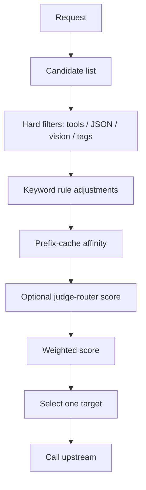
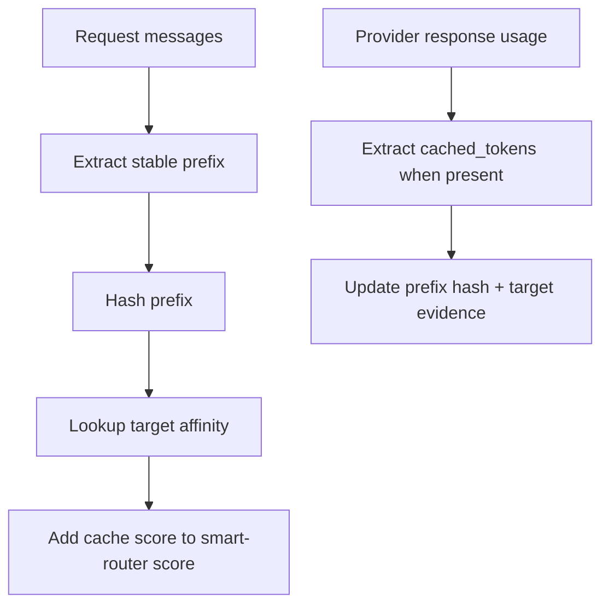
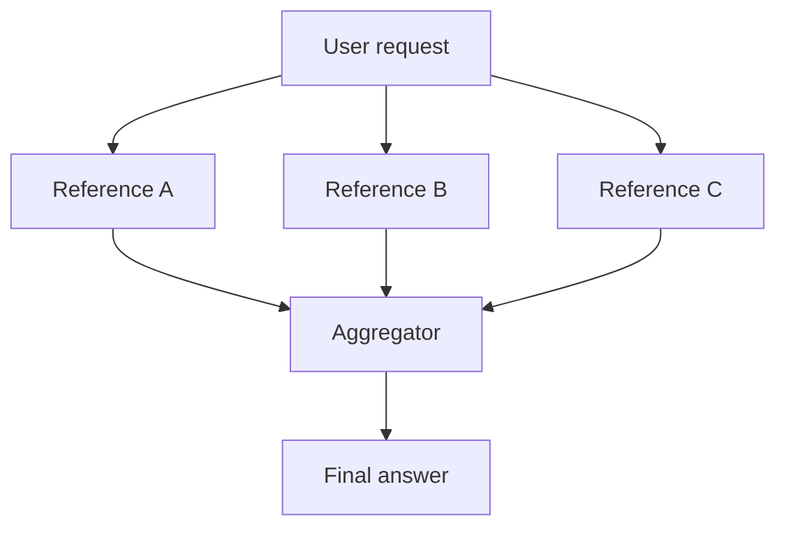
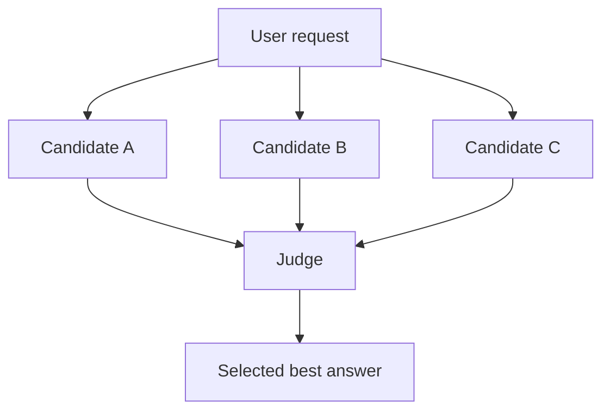

# XRouter Strategies

## Strategy families

| Kind | Final upstream calls | Typical use |
|---|---:|---|
| `direct_alias` | 1 | Compatibility aliases and fixed provider/model mapping. |
| `smart_router` | 1 | Automatic target selection without multi-model answer generation. |
| `moa` | N + aggregator | Reference models plus final aggregator. |
| `mov` | Depends on flow | General multi-model orchestration variants. |
| `passthrough` | 1 | Forward the original model ID through an explicitly configured passthrough provider policy. |

## Direct alias


Properties:

- no prompt rewrite
- no model scoring
- no judge
- no MoV
- normal fallback may still apply if configured

## Smart router

The smart router selects a single target. It can use rules, scoring, prefix-cache bookkeeping, and an optional judge-router model.



The capability filters are hard gates. A request that requires tools, JSON output, or vision will not be routed to a target that lacks that capability; if all candidates are filtered out, routing fails.

### Weighted score

```text
score(target) =
    w_quality     * target.quality_score
  + w_cost        * inverse_cost_score
  + w_latency     * latency_score
  + w_reliability * reliability_score
  + w_cache       * cache_affinity_score
  + w_capability  * capability_fit_score
  + w_sticky      * session_sticky_score
  + w_judge       * judge_score
  + keyword_rule_score
```

### Objectives

| Objective | Behavior |
|---|---|
| `balanced` | Balanced quality/cost/latency/reliability. |
| `quality` | Favors stronger targets and judge/router signals. |
| `cost` | Favors cheaper targets unless capability filters fail. |
| `latency` | Favors low-latency targets and cache affinity. |

## Prefix-cache bookkeeping

Prefix matching is optional because it adds state and can bias routing. It can be enabled globally, per route, or per request.



XRouter stores hashes and numeric evidence, not raw prompt prefixes.

### Affinity formula

```text
cache_affinity =
    recency_decay
  * prefix_strength
  * hit_evidence
  * cached_token_evidence
  * target.cache_support_score
```

## Judge router

The judge router is not the final answering model. It receives a compact route-selection prompt and returns structured JSON similar to:

```json
{
  "target": "openai-smart",
  "scores": {
    "openai-smart": 0.91,
    "or-sonnet": 0.83
  },
  "reason": "The request is complex code analysis and favors high quality."
}
```

The smart router treats judge scores as one weighted signal, not as an absolute command.

## MoV / MoA flows

XRouter currently exposes named flow implementations through `flow`. The generic route-level `stages` array is reserved for a future stage DSL and is rejected by config validation in this release, so production configs should use the explicit flow fields below instead of expecting arbitrary stage execution.

### 1. Parallel synthesize



Use for: reasoning, architecture, open-ended synthesis.

Reference outputs are passed to the aggregator as delimited user-role context, while the synthesis instruction stays in the system role. This keeps advisory model output lower privilege than configured router instructions.

### 2. Parallel judge select



Use for: answer quality tournaments, style variants, safety-sensitive answer selection.

### 3. Best-of-N self-consistency

Runs the same or similar targets multiple times with sampling diversity, then selects or synthesizes the most consistent answer.

Use for: math, short reasoning, deterministic verification.

### 4. Propose / critique / revise

```text
proposer -> critic -> reviser
```

Use for: writing, plans, code review, document revisions.

### 5. Serial chain relay

```text
A drafts -> B improves -> C finalizes
```

Use for: staged refinement with specialized models.

### 6. Map-reduce specialists

```text
planner -> multiple specialists -> reducer
```

Use for: broad analysis, multi-section documents, repo-level questions.

### 7. Verify then escalate

```text
cheap/mid answer -> verifier -> strong model only if verifier fails
```

Use for: cost control with correctness checks.

### 8. Cascade budget

```text
cheap -> mid -> strong
```

Use for: low-cost default with escalation on failure/weak output.

The cascade gate uses observable response signals only: HTTP success, incomplete/length finish reasons, optional visible-output threshold, and JSON parseability when the request asks for JSON.

### 9. Dual-path tool acting

One model acts and can use tools. Optional `serial_listeners` can run reviewer-like side-channel checks after the primary answer; they do not revise the returned answer inline.

Use for: agentic tasks where tool execution should remain controlled.

### 10. Shadow evaluation

Primary answer returns normally. Shadow targets run off to the side for evaluation and telemetry.

Use for: model migration, regression sampling, route training data.

## v5: Degradation Guard / Race Strategy Family

XRouter v5 keeps a `race` strategy family for provider/runtime anomalies such as fixed reasoning-token clusters, incomplete responses, or unexpectedly short outputs. Race flows are configured as `kind: mov` routes:

| Flow | Behavior |
|---|---|
| `parallel_race_max_output_v1` | Run equivalent attempts in parallel; select the largest visible/output result. |
| `boundary_guard_race_v1` | Run attempts in parallel; penalize attempts whose reasoning-token count hits `boundary_start + boundary_step*k`. |
| `effort_ladder_race_v1` | Run the same target with several `reasoning.effort` values, then select by boundary-aware score. |
| `serial_boundary_escalate_v1` | Run primary first; escalate only when primary is incomplete, too short, or boundary-hit. |

The default boundary sequence is `516 + 518(n-1)`, but both start and step are route-level config values.
For `race.selection: fastest_acceptable`, XRouter returns the first successful non-degraded attempt and cancels remaining attempts; comparison-based selections still wait for all results.

See `docs/DEGRADATION_GUARD_AND_RACE.md` for formulas and Mermaid diagrams.
