# XRouter Strategy Design v3

> 本文档是策略与算法设计基线。当前代码包已经收敛为单 Go 实现，开发应以这些策略接口和流程为准。

## 结论

XRouter 的核心不应是“每次都多模型”，而应是：

```text
incoming model ID
  -> 配置文件解析策略
  -> 请求级 override 修正策略
  -> 根据策略执行 direct / smart single-route / MoV multi-route
  -> 记录 route trace、prefix cache bookkeeping、provider metrics
```

## 三类基础策略

| 策略族 | 是否改写内容 | 是否多模型 | 典型用途 |
|---|---:|---:|---|
| `direct_alias` | 不改写 prompt；只改目标 model/provider | 否 | 固定模型 ID 映射、兼容 OpenAI SDK、兼容 OpenCode |
| `smart_router` / `auto` | 默认不改写 prompt；可用 classifier/judge 只做路由决策 | 否 | 根据任务、成本、延迟、缓存、能力自动选一个目标模型 |
| `mov` / `moa` | 可能生成中间 prompt、聚合 prompt、裁判 prompt | 是 | 多模型综合、投票、裁判、链式改写、验证升级 |

## 文件索引

| 文件 | 内容 |
|---|---|
| `docs/00-product-positioning.md` | 产品定位、术语、外部参照 |
| `docs/01-model-id-dispatch.md` | model ID 到策略的分派算法 |
| `docs/02-smart-router-algorithms.md` | auto / smart router 算法族 |
| `docs/03-prefix-cache-bk.md` | 前缀匹配、缓存 bookkeeping、权重衰减算法 |
| `docs/04-mov-moa-strategy-flows.md` | 10 组 MoV / MoA 多模型策略流程 |
| `docs/05-config-and-request-contract.md` | 配置文件与请求级 override 合约 |
| `docs/06-algorithm-parameters.md` | 默认权重、阈值、决策矩阵 |
| `docs/07-implementation-boundary.md` | 后续 Go 开发边界与模块拆分 |
| `examples/xrouter.strategy.example.yaml` | 完整策略配置示例 |
| `examples/request-overrides.chat.json` | 请求级动态策略示例 |

## 图文件

`diagrams/*.mmd` 是 Mermaid 源文件，可直接放到 GitHub / GitLab / Obsidian / Mermaid Live Editor 渲染。

`diagrams/*.svg` 是部分核心流程的可视化渲染版。


---

# 00. 产品定位、术语与外部参照

## 0.1 结论

XRouter 应定义为一个 **OpenAI-compatible model gateway + strategy router**，而不是一个单纯的“模型代理”。

它对外暴露 OpenAI 风格接口，例如：

```text
POST /v1/chat/completions
POST /v1/responses
GET  /v1/models
```

它对内通过配置文件和请求级参数决定：

```text
这个 model ID 是固定映射？
还是 smart router？
还是 MoV / MoA 多模型编排？
是否启用前缀缓存亲和？
是否启用裁判模型？
是否启用旁路监听？
```

## 0.2 核心术语

| 术语 | XRouter 内部含义 |
|---|---|
| `incoming model ID` | 客户端请求里的 `model` 字段，例如 `gpt-4o`、`xrouter/auto`、`xrouter/mov/parallel-synth` |
| `route` | 一个 model ID 对应的策略入口 |
| `target` | 一个真实上游模型实例，例如 `openai:gpt-4.1-mini`、`openrouter:anthropic/claude-sonnet-4` |
| `provider` | 上游平台，例如 OpenAI、OpenRouter、本地 vLLM、内部服务 |
| `direct_alias` | 固定 ID 映射。只改目标 provider/model，不改 prompt |
| `smart_router` / `auto` | 根据特征、缓存、成本、延迟、能力、裁判模型等因素选择**一个**最终 target |
| `prefix cache BK` | prefix cache bookkeeping。XRouter 自己维护的缓存命中倾向表，不等于 provider 真实 prompt cache |
| `MoA` | Mixture of Agents。典型形式是 reference models 先生成中间结果，aggregator 汇总输出 |
| `MoV` | XRouter 建议使用的宽泛内部名：Multi-model Orchestration Variant。覆盖 MoA、投票、裁判、链式、验证升级、旁路评测等多模型策略 |
| `shadow` | 旁路调用。主响应不等待或不依赖旁路结果 |
| `serial listener` | 串行监听。主模型输出后，再让 listener 模型评估或补充，可选地把结果附加到 trace |

## 0.3 外部参照，不直接照搬

### OpenRouter 相关启发

OpenRouter 的公开设计里有两个对 XRouter 有价值的点：

1. model routing 和 provider routing 是两层不同决策：先决定哪个模型回答，再决定哪个 provider 承载。
2. prompt caching 场景里，sticky routing 能提高后续请求打到同一 provider endpoint 的概率，从而提升缓存命中率。

XRouter 应保留这两层拆分：

```text
model route: 选逻辑模型 / 目标模型
provider route: 选具体 provider / endpoint
```

### Hermes Agent MoA 相关启发

Hermes Agent 的 MoA 把多模型 preset 暴露成“虚拟模型”。reference models 先运行，aggregator 是最终写答案和执行工具调用的 acting model。

XRouter 可采用这个思想，但不应只支持一种 MoA。应把它抽象为 `mov` 策略族。

### OpenCode 相关启发

OpenCode 能通过 OpenAI-compatible provider + `baseURL` 接入自定义网关。因此 XRouter 必须首先保证：

```text
普通客户端只改 base_url 和 model ID 就能接入。
```

这也是 `direct_alias` 必须存在的原因：不能让所有请求都变成复杂路由。

## 0.4 产品原则

| 原则 | 解释 |
|---|---|
| model ID 是策略入口 | `model` 字段不是只表示真实模型，也可以表示一个策略虚拟模型 |
| 默认不改 prompt | direct 和 smart single-route 默认不对 messages 做替换处理 |
| 多模型必须可关闭 | MoV/MoA 只能按策略、复杂度、采样、预算触发 |
| 前缀缓存必须可开关 | 不同租户、不同隐私级别可能不允许记录 prefix BK |
| 裁判模型必须受控 | judge 只允许在候选集合内选择，必须有 timeout 和 fallback |
| 所有算法可调 | 权重、阈值、候选集、缓存衰减、采样率都进配置文件 |
| trace 先行 | 每次路由要产出 route trace，否则无法调参 |


---

# 01. Model ID 到策略的分派算法

## 1.1 结论

XRouter 的第一层算法不是“选模型”，而是：

```text
根据请求里的 model ID，解析应该执行哪一种策略。
```

这层必须非常稳定。它决定请求进入：

```text
direct_alias
smart_router / auto
mov / moa
pass_through
reject
```

## 1.2 分派优先级

推荐优先级：

```text
1. 系统强制策略，例如 admin/tenant policy
2. 请求级 override，例如 xrouter.route / x-xrouter-route
3. exact model ID match
4. prefix model ID match
5. regex / glob match
6. configured target ID
7. default route
8. unknown_model_policy: reject / passthrough_openai / passthrough_openrouter
```

不要只做 prefix match。固定模型 ID 必须优先于 prefix，否则 `xrouter/auto-code` 可能被 `xrouter/auto*` 误吃掉。

## 1.3 总流程图

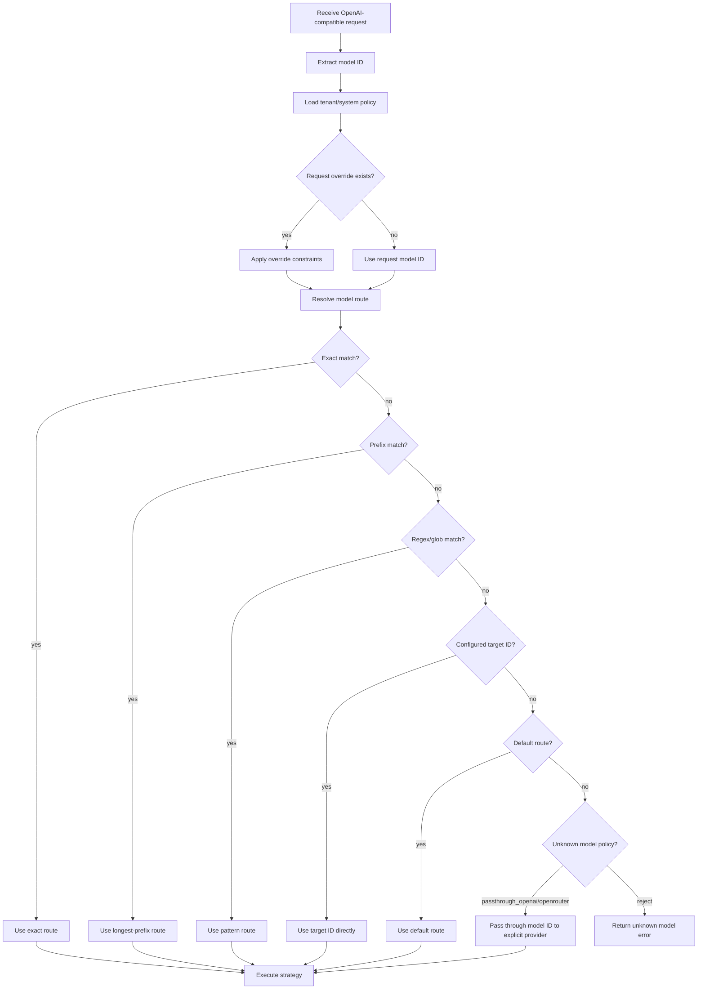

## 1.4 策略分派类型

### A. `direct_alias`

固定映射，不做 prompt 替换处理。

```yaml
routes:
  gpt-4o-mini:
    kind: direct_alias
    target: openai_gpt_4_1_mini
    rewrite:
      prompt: false
      tools: false
      params: false
```

执行语义：

```text
incoming model = gpt-4o-mini
route kind     = direct_alias
target model   = gpt-4.1-mini
prompt         = 原样透传
```

这类策略应是最基础、最高性能、最低风险路径。

### B. `smart_router`

根据策略选一个 target，最终仍是单模型回答。

```yaml
routes:
  xrouter/auto:
    kind: smart_router
    policy: smart_balanced_v1
```

执行语义：

```text
incoming model = xrouter/auto
policy         = smart_balanced_v1
selected       = one target only
```

### C. `mov`

多模型编排策略。`mov` 是 XRouter 的总称，MoA 是其中一种。

```yaml
routes:
  xrouter/mov/parallel-synth:
    kind: mov
    flow: parallel_synthesize_v1
```

执行语义：

```text
incoming model = xrouter/mov/parallel-synth
flow           = parallel_synthesize_v1
selected       = multiple targets + aggregator
```

### D. `pass_through`

未知模型 ID 直接作为上游 model ID 透传到显式配置的 provider。当前实现不根据模型名是否包含 `/` 自动判断 provider。

```yaml
routing_defaults:
  unknown_model_policy: passthrough_openrouter
```

这适合 OpenRouter 这类“模型名很多、变化频繁”的 provider。

## 1.5 Prefix route 的正确用法

prefix route 不是 prompt prefix cache。这里的 prefix 是 model ID 前缀，例如：

```yaml
prefix_routes:
  xrouter/auto/:
    kind: smart_router
    policy_from_suffix: true

  xrouter/mov/:
    kind: mov
    flow_from_suffix: true
```

例子：

| incoming model | 解析结果 |
|---|---|
| `xrouter/auto/code` | `smart_router` + `policy=code` |
| `xrouter/auto/cost` | `smart_router` + `policy=cost` |
| `xrouter/mov/verify-escalate` | `mov` + `flow=verify-escalate` |

## 1.6 请求级 override 边界

请求级 override 只能在配置允许范围内修改策略。

推荐规则：

```text
route.kind 不允许被普通用户越权改成任意 provider
candidates 只能从 route.allowed_targets 中选子集
provider_api_key 只有 BYOK 租户才允许传
multi_model 可以从 auto 降成 never，但不能从 never 强制 always，除非 route 允许
```

## 1.7 Route trace

每次分派后都应生成 trace：

```json
{
  "incoming_model": "xrouter/auto/code",
  "resolved_route": "xrouter/auto/code",
  "route_kind": "smart_router",
  "policy": "smart_code_v1",
  "override_applied": true,
  "dispatch_reason": "prefix route xrouter/auto/ + suffix code"
}
```


---

# 02. Smart Router / Auto 算法族

## 2.1 结论

Smart router 的定义应非常明确：

```text
Smart router 最终只选择一个 target。
它不是 MoA，不并行问多个模型给用户答案。
```

它的价值在于：

```text
低成本请求走便宜模型
高复杂度请求走强模型
长上下文/多轮任务优先走缓存命中概率高的 provider/model
代码任务走代码强模型
工具调用任务走工具调用稳定模型
JSON 任务走结构化输出更稳的模型
```

## 2.2 Smart router 总流程

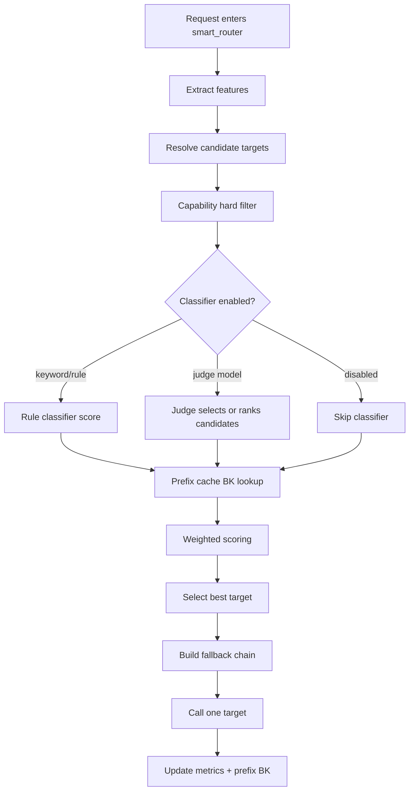

## 2.3 输入特征

Smart router 至少提取以下特征：

| 特征 | 用途 |
|---|---|
| `prompt_tokens_est` | 判断长上下文、成本、缓存价值 |
| `message_count` | 判断多轮上下文 |
| `has_tools` | 需要 tool-call 能力过滤 |
| `tool_count` | 工具复杂度 |
| `wants_json` | 需要 JSON/structured output 稳定性 |
| `has_vision_input` | 需要 vision 能力过滤 |
| `code_signal` | 代码生成/调试/仓库理解路由 |
| `math_signal` | 数学/推理任务路由 |
| `planning_signal` | 架构、规划、长答案路由 |
| `risk_signal` | 高风险任务路由到更稳模型或要求 verifier |
| `latency_sla_ms` | 过滤慢模型 |
| `budget_hint` | 控制成本 |
| `session_id` | sticky / cache affinity |
| `prefix_hash` | prefix cache BK 查询 |

## 2.4 候选过滤：hard gates

在评分前先做硬过滤：

```text
如果请求有 tools，则过滤掉不支持 tool_call 的 target
如果请求有 vision input，则过滤掉不支持 vision 的 target
如果请求要求 response_format=json_schema，则过滤掉结构化输出不稳定或不支持的 target
如果 prompt_tokens_est > target.context_window，则过滤掉上下文不够的 target
如果 tenant policy 禁止某 provider，则过滤掉该 provider
如果请求指定 candidates，则只在 candidates 子集内选择
```

硬过滤不应被权重覆盖。

## 2.5 基础加权评分算法

所有分项归一化到 `[0, 1]`。

推荐公式：

```text
score(target) =
    w_quality     * quality_score(target, task)
  + w_cost        * inverse_cost_score(target, request)
  + w_latency     * latency_score(target)
  + w_reliability * reliability_score(target)
  + w_cache       * cache_affinity_score(target, prefix)
  + w_capability  * capability_fit_score(target, task)
  + w_sticky      * session_sticky_score(target, session)
  + w_judge       * judge_score(target)
  - penalties(target, request)
```

默认权重不应写死，应放在配置文件里。

### 质量分 `quality_score`

配置给每个 target 一个基础质量分，再按任务类型修正：

```yaml
targets:
  openai_smart:
    scores:
      quality: 0.92
      code: 0.86
      tool_call: 0.90
      json: 0.88
  cheap_fast:
    scores:
      quality: 0.62
      code: 0.55
      tool_call: 0.61
      json: 0.58
```

任务修正：

```text
quality_score = base_quality
              + code_signal * code_bonus
              + tool_signal * tool_bonus
              + json_signal * json_bonus
              + math_signal * reasoning_bonus
```

### 成本分 `inverse_cost_score`

越便宜分越高。

```text
estimated_cost = input_tokens * input_price + output_tokens_est * output_price
inverse_cost_score = 1 - normalize_log_cost(estimated_cost)
```

### 延迟分 `latency_score`

```text
latency_score = clamp(1 - p50_latency_ms / latency_sla_ms, 0, 1)
```

可混合 p95：

```text
latency_score = 0.7 * p50_score + 0.3 * p95_score
```

### 可靠性分 `reliability_score`

```text
reliability_score = 1 - error_rate_5m * a - timeout_rate_5m * b
```

### 缓存亲和分 `cache_affinity_score`

见 `03-prefix-cache-bk.md`。

## 2.6 关键词 / 规则 classifier

这是最便宜的 smart router。

流程：

```text
extract keywords/signals
match route rules
produce target bonus or forced target
```

例子：

```yaml
rules:
  - name: code_debug
    when:
      any_keywords: ["panic", "traceback", "segfault", "race condition", "编译错误", "堆栈"]
    bonus:
      code_models: 0.18

  - name: json_required
    when:
      response_format: json_schema
    require_capability: structured_output
```

优点：快、便宜、可解释。
缺点：容易被 prompt 表述误导，泛化差。

## 2.7 Judge model classifier

Judge model 只用于**路由决策**，不是最终回答。

流程：

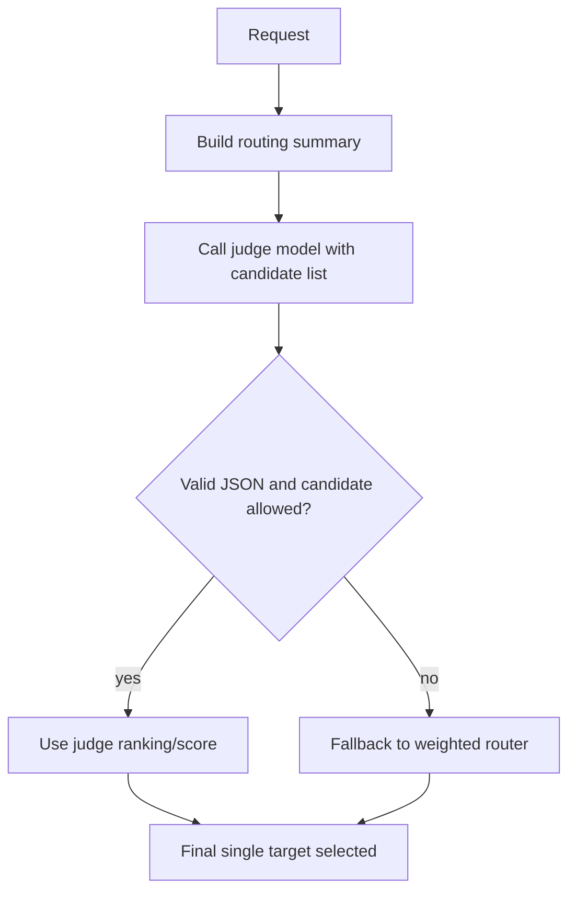

Judge 输出必须受 schema 约束：

```json
{
  "task_type": "code_debug|general_chat|math|writing|tool_use|long_context|unknown",
  "complexity": 0.0,
  "selected_target": "openai_smart",
  "ranked_targets": [
    {"target": "openai_smart", "score": 0.91, "reason": "best for code + tools"},
    {"target": "cheap_fast", "score": 0.55, "reason": "too weak for debugging"}
  ],
  "confidence": 0.82
}
```

安全边界：

```text
judge 只能从 allowed_candidates 里选
judge timeout 后必须走无 judge 路线
judge cost 必须计入 router overhead budget
judge prompt 不应包含完整敏感上下文；优先使用摘要/特征
```

## 2.8 Hybrid smart router 推荐实现

推荐首个生产版本使用 hybrid：

```text
hard gates
  -> request override
  -> prefix cache BK lookup
  -> cheap keyword classifier
  -> optional judge model when ambiguous/high-value
  -> weighted scoring
  -> single target
```

伪代码：

```pseudo
function smart_route(request, policy):
    features = extract_features(request)
    candidates = resolve_candidates(policy, request.override)
    candidates = hard_filter(candidates, features, tenant_policy)

    if candidates.empty:
        return error("no eligible target")

    route_notes = []

    cache_hits = prefix_cache.lookup(features.prefix_hash) if policy.cache.enabled else []
    rule_scores = rule_classifier.score(features, candidates) if policy.rules.enabled else {}

    if policy.judge.enabled and should_call_judge(features, candidates, policy):
        judge_scores = call_judge_with_timeout(features, candidates)
    else:
        judge_scores = {}

    for target in candidates:
        s[target] = weighted_sum(
            quality(target, features),
            inverse_cost(target, features),
            latency(target),
            reliability(target),
            cache_affinity(target, cache_hits),
            capability_fit(target, features),
            session_sticky(target, features.session_id),
            judge_scores[target],
            rule_scores[target]
        )

    selected = argmax(s)
    fallback_chain = sort_desc(s without selected)
    return selected, fallback_chain, route_trace
```

## 2.9 Auto 不等于多模型

`xrouter/auto` 默认应是 smart single-route：

```text
xrouter/auto -> 选择一个 target -> 只调用一个模型
```

只有配置明确允许时才升级：

```yaml
routes:
  xrouter/auto:
    kind: smart_router
    policy: smart_balanced_v1
    escalation:
      to_mov: xrouter/mov/verify-escalate
      when:
        complexity_gte: 0.82
        budget_allows: true
        multi_model_mode: auto
```

也就是说：

```text
smart router 是单点选择算法；
MoV/MoA 是多模型执行算法；
两者可以串联，但不能混为一谈。
```


---

# 03. Prefix Cache BK：前缀匹配与缓存权重算法

## 3.1 结论

前缀匹配的目的不是“XRouter 自己缓存模型回答”，而是：

```text
让后续相似前缀的请求更可能打到同一个 provider / endpoint / model，
从而提高上游 provider prompt cache 命中概率。
```

因此 XRouter 需要维护一个轻量的 **prefix cache bookkeeping**，简称 `prefix cache BK`。

这必须是可开关能力：

```yaml
prefix_cache:
  enabled: true
  mode: hash_only
  ttl_seconds: 21600
```

## 3.2 关键区分

| 概念 | 说明 |
|---|---|
| provider prompt cache | 上游模型服务自己的 KV/prompt cache，XRouter 通常无法直接控制 |
| XRouter prefix cache BK | XRouter 记录“某个 prefix 最近在哪个 target/provider 上可能有缓存亲和” |
| response cache | 直接缓存最终回答；这是另一类产品能力，不建议和 prefix BK 混在一起 |

## 3.3 Prefix 的来源

推荐同时支持三种 prefix key：

| 层级 | 名称 | 组成 | 用途 |
|---|---|---|---|
| L0 | `session_prefix` | `tenant_id + session_id` | 多轮对话 sticky |
| L1 | `prompt_prefix` | system/developer/tools/前 N 条消息的规范化 hash | provider prompt cache 亲和 |
| L2 | `explicit_cache_hint` | 请求传入的 `xrouter.cache.prefix_hint` | 用户显式指定业务缓存组 |

## 3.4 Prefix 规范化

为了稳定命中，不能直接 hash 原始 JSON。应规范化：

```text
1. 只取适合缓存的前缀消息：system/developer/tools/固定项目上下文/前 N 条稳定消息
2. 去掉 volatile 字段：timestamp、request id、nonce、临时调试信息
3. 工具 schema 按 key 排序
4. message content 做空白归一化
5. 计算 token count estimate
6. hash: sha256(tenant_salt + canonical_prefix)
```

默认建议 `hash_only`，不保存原文。

## 3.5 BK Entry 数据结构

```json
{
  "prefix_hash": "sha256:...",
  "tenant_id": "tenant-a",
  "session_id": "thread-123",
  "target_id": "openai_smart",
  "provider_id": "openai",
  "upstream_model": "gpt-4.1",
  "endpoint_fingerprint": "openai-us-east-1-or-null",
  "first_seen_at": 1782620000,
  "last_seen_at": 1782620300,
  "hit_count": 7,
  "prompt_tokens_est": 18000,
  "last_prompt_cache_read_tokens": 14500,
  "last_prompt_cache_creation_tokens": 1200,
  "avg_ttft_ms": 620,
  "avg_latency_ms": 4100,
  "last_status": 200,
  "confidence": 0.86
}
```

## 3.6 Lookup 流程图

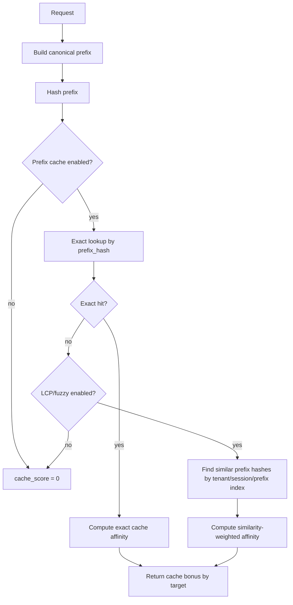

## 3.7 Cache affinity 公式

推荐公式：

```text
age_seconds = now - entry.last_seen_at
recency_decay = exp(-age_seconds / tau_seconds)

prefix_strength = clamp(entry.prompt_tokens_est / policy.cache.full_strength_tokens, 0, 1)
cache_read_ratio = clamp(entry.last_prompt_cache_read_tokens / max(entry.prompt_tokens_est, 1), 0, 1)
health = 1 if last_status == 200 else 0.3
similarity = exact ? 1.0 : lcp_similarity

cache_affinity_score =
    recency_decay
  * prefix_strength
  * max(cache_read_ratio, policy.cache.min_assumed_read_ratio)
  * health
  * similarity
  * target.cache_support_score
```

默认参数：

```yaml
prefix_cache:
  tau_seconds: 10800            # 3 小时半衰倾向；不是严格半衰公式
  full_strength_tokens: 12000   # 长 prefix 的缓存价值更大
  min_assumed_read_ratio: 0.20  # 没有 provider cache usage 回传时的保守估计
  exact_bonus_cap: 0.28
  fuzzy_bonus_cap: 0.12
```

## 3.8 权重如何影响最终路由

在 smart router 中：

```text
final_score = base_score + w_cache * cache_affinity_score
```

例子：

| target | base_score | cache_affinity | `w_cache=0.20` 后 |
|---|---:|---:|---:|
| `strong_slow` | 0.78 | 0.05 | 0.79 |
| `medium_cached` | 0.72 | 0.90 | 0.90 |
| `cheap_fast` | 0.67 | 0.10 | 0.69 |

这会把长上下文多轮任务稳定打向 `medium_cached`。

## 3.9 BK 更新时机

每次上游返回后更新：

```text
成功响应：更新 last_seen、hit_count、latency、usage、cache tokens
失败响应：降低 confidence，记录 error
fallback 成功：把成功 target 也写入 BK
stream 响应：结束后更新；中途中断则降低 confidence
```

伪代码：

```pseudo
function update_prefix_bk(request, target, response):
    if !policy.prefix_cache.enabled:
        return

    prefix_hash = build_prefix_hash(request)
    entry = store.get(prefix_hash, target)
    entry.last_seen_at = now
    entry.hit_count += 1 if response.status == 200 else 0
    entry.last_status = response.status
    entry.avg_latency_ms = ema(entry.avg_latency_ms, response.latency_ms)
    entry.last_prompt_cache_read_tokens = normalize_cache_read_tokens(response.usage)
    entry.last_prompt_cache_creation_tokens = normalize_cache_creation_tokens(response.usage)
    entry.confidence = update_confidence(entry, response)
    store.put(entry, ttl)
```

## 3.10 Provider usage 字段归一化

不同 provider 的 cache usage 字段可能不同。XRouter 内部统一成：

```json
{
  "input_tokens": 18000,
  "output_tokens": 900,
  "cache_read_input_tokens": 14500,
  "cache_creation_input_tokens": 1200
}
```

如果上游没有返回 cache tokens：

```text
只根据 session/prefix/recency 做弱亲和，不做强亲和。
```

## 3.11 可开关策略

```yaml
prefix_cache:
  enabled: true
  privacy_mode: hash_only       # hash_only | store_prefix | off
  lookup:
    exact: true
    fuzzy_lcp: false            # 第一版可关闭，避免复杂索引
  update:
    read_usage_from_provider: true
    write_on_success: true
    write_on_error: true
  routing_weight:
    default: 0.20
    max: 0.35
```

## 3.12 什么时候不应使用 prefix cache BK

```text
一次性短 prompt
严格要求最低延迟，BK lookup 本身不能增加开销
租户不允许记录任何 prompt 派生信息
任务必须由特定模型回答，不能因缓存迁移
命中 target 能力不足，例如不支持工具/vision/json schema
```


---

# 04. MoV / MoA 多模型策略流程

## 4.1 结论

XRouter 不应只实现一种 MoA。建议把多模型策略统一放到 `mov` 策略族下：

```text
MoV = Multi-model Orchestration Variant
```

MoA 是 MoV 的一个子类：

```text
reference models -> aggregator
```

但产品上还应支持：投票、裁判选择、链式修订、验证升级、map-reduce、旁路评测等。

## 4.2 多模型触发原则

多模型不是默认路径。推荐触发策略：

```yaml
multi_model:
  mode: auto            # never | auto | always | sample | budget_guarded
  complexity_gte: 0.78
  sample_rate: 0.15
  max_extra_cost_usd: 0.08
  max_extra_latency_ms: 20000
  force_for:
    - high_value_code_review
    - long_architecture_design
  disable_for:
    - simple_chat
    - streaming_required
```

## 4.3 MoV 流程总览

| 编号 | flow ID | 核心流程 | 是否最终多模型 | 适用场景 |
|---:|---|---|---:|---|
| 1 | `parallel_synthesize_v1` | 多 reference 并行，aggregator 综合 | 是 | 方案设计、复杂分析、长文总结 |
| 2 | `parallel_judge_select_v1` | 多 candidate 并行，judge 选择最佳 | 是 | 代码补丁、多答案择优、benchmark |
| 3 | `best_of_n_self_consistency_v1` | 同/异模型多采样，投票或一致性选择 | 是 | 数学题、分类、结构化判断 |
| 4 | `propose_critique_revise_v1` | proposer 出稿，critic 批评，reviser 修订 | 是 | 写作、需求文档、设计评审 |
| 5 | `serial_chain_relay_v1` | A -> B -> C 链式传递改写 | 是 | 逐步精炼、不同能力模型接力 |
| 6 | `map_reduce_specialists_v1` | planner 拆任务，specialists 处理，reducer 汇总 | 是 | 大任务、仓库分析、多领域问题 |
| 7 | `verify_then_escalate_v1` | 单模型先答，verifier 判定是否升级 | 条件是 | 成本敏感、质量兜底 |
| 8 | `cascade_budget_v1` | cheap -> mid -> strong 预算阶梯 | 条件是 | 大流量生产、成本控制 |
| 9 | `dual_path_tool_acting_v1` | acting model 负责工具；reviewer 检查；acting final | 是 | 工具调用、agent 工作流 |
| 10 | `shadow_evaluation_v1` | 主路由返回；旁路模型只评测/记录 | 否，对用户不是 | 新模型评估、路由训练数据 |

---

## 4.4 Flow 1：`parallel_synthesize_v1`

### 流程

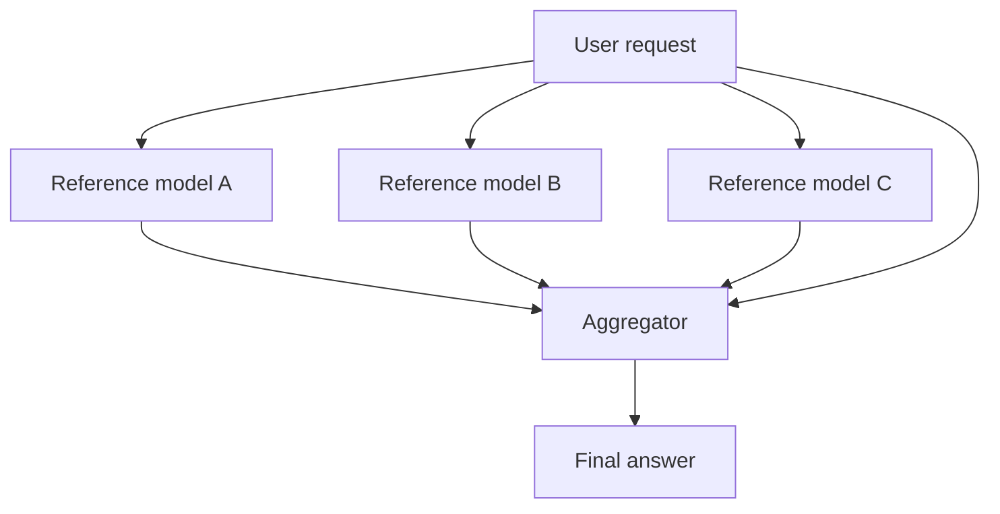

### 语义

```text
多个 reference models 并行分析同一个请求。
aggregator 读取原始请求 + reference outputs，生成最终答案。
```

### 推荐配置

```yaml
flows:
  parallel_synthesize_v1:
    type: parallel_synthesize
    references: [cheap_fast, code_strong, reasoning_strong]
    aggregator: openai_smart
    reference_prompt: concise_analysis
    aggregator_prompt: synthesize_best_answer
    allow_partial_references: true
    reference_timeout_ms: 12000
```

### 注意

```text
reference 输出不直接返回用户
aggregator 是唯一 final writer
如果有工具调用，默认只允许 aggregator 发 tool_call
```

---

## 4.5 Flow 2：`parallel_judge_select_v1`

### 流程

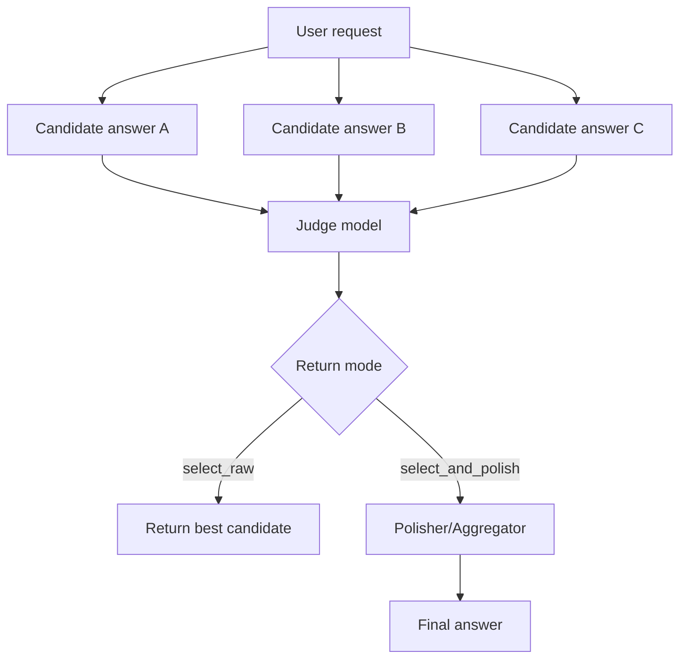

### 语义

```text
多模型各自独立生成答案。
judge 选择最佳答案，或者选择后交给 polisher 轻量修订。
```

### 适用

```text
代码补丁
不同模型容易给出不同方案的问题
benchmark/eval 样本生成
```

### 配置

```yaml
flows:
  parallel_judge_select_v1:
    type: parallel_judge_select
    candidates: [openai_smart, or_sonnet, cheap_fast]
    judge: judge_small
    return_mode: select_and_polish  # select_raw | select_and_polish
    polisher: openai_smart
```

---

## 4.6 Flow 3：`best_of_n_self_consistency_v1`

### 流程

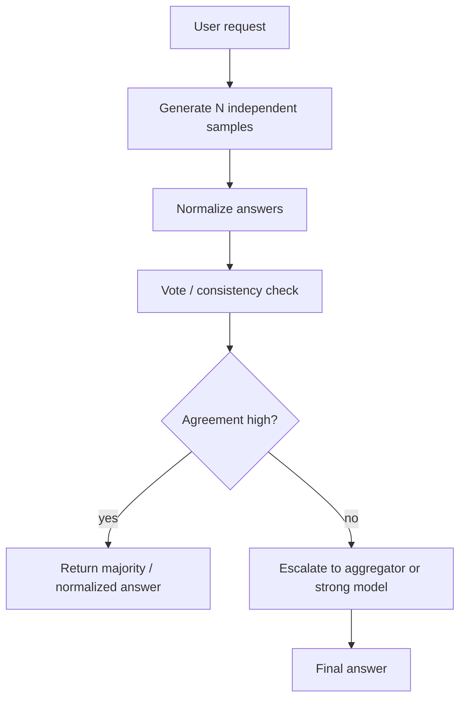

### 语义

```text
同一个模型或多个模型生成 N 个独立样本。
对结构化结论做投票、一致性检查。
```

### 适用

```text
数学/逻辑题
分类/打标
选择题
JSON 提取
```

### 配置

```yaml
flows:
  best_of_n_self_consistency_v1:
    type: self_consistency
    targets: [cheap_fast]
    n: 5
    temperature: 0.7
    vote_method: exact_or_semantic
    disagreement_escalation: openai_smart
```

---

## 4.7 Flow 4：`propose_critique_revise_v1`

### 流程

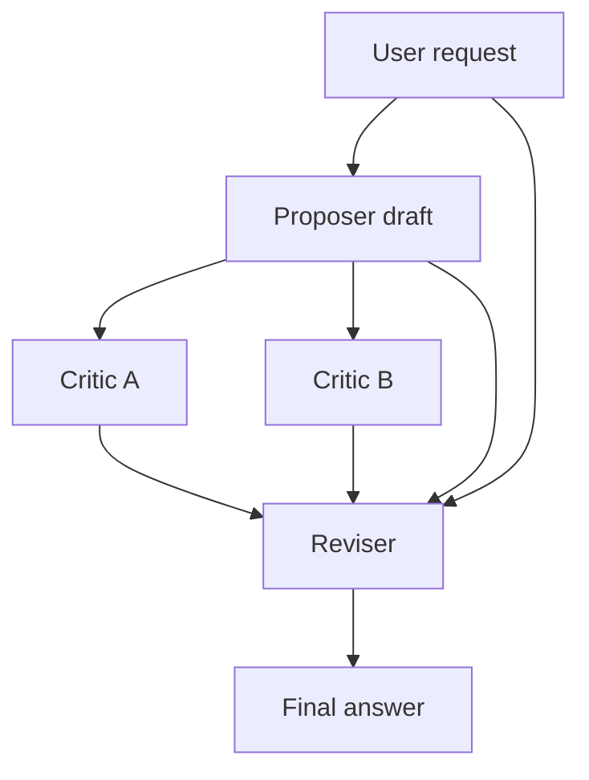

### 语义

```text
先生成初稿，再批评，再修订。
```

### 适用

```text
产品设计文档
PRD
复杂邮件/报告
代码审查意见
```

### 配置

```yaml
flows:
  propose_critique_revise_v1:
    type: propose_critique_revise
    proposer: cheap_fast
    critics: [reasoning_strong, code_strong]
    reviser: openai_smart
    critic_prompt: find_missing_or_wrong_points
    reviser_prompt: produce_final_using_critique
```

---

## 4.8 Flow 5：`serial_chain_relay_v1`

### 流程

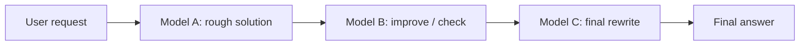

### 语义

```text
A 给 B，B 给 C，C 结合之前上下文输出最终版本。
```

### 适用

```text
需要“逐步接力”的任务
便宜模型先做草稿，强模型最后把关
不同模型有明确角色分工
```

### 风险

```text
错误可能在链上放大
总延迟是串行相加
需要限制每一步输出长度
```

---

## 4.9 Flow 6：`map_reduce_specialists_v1`

### 流程

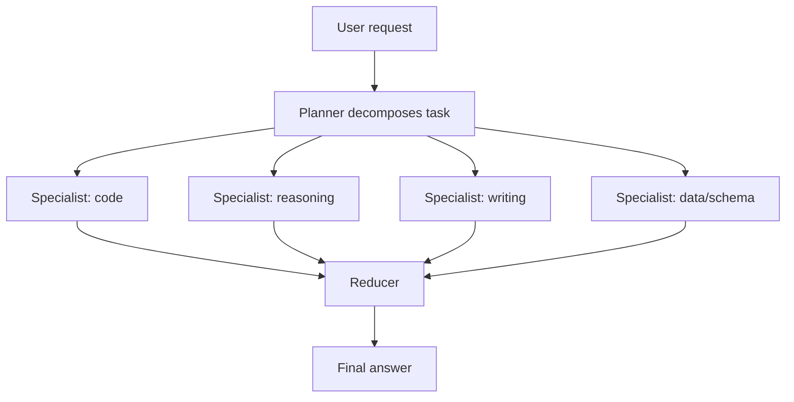

### 语义

```text
planner 把任务拆成子任务。
不同 specialist 处理不同子任务。
reducer 汇总。
```

### 适用

```text
大型架构设计
多文件仓库分析
长文档审阅
产品 + 技术 + 成本综合问题
```

---

## 4.10 Flow 7：`verify_then_escalate_v1`

### 流程

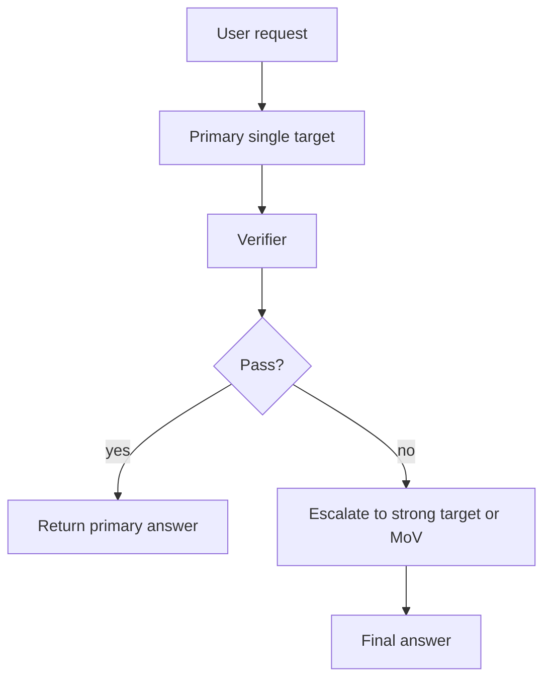

### 语义

```text
先按普通单模型路径回答。
用 verifier 评估是否需要升级。
```

### 适用

```text
既要控制成本，又要保证复杂任务质量
大多数请求简单，少数请求需要强模型
```

### 配置

```yaml
flows:
  verify_then_escalate_v1:
    type: verify_then_escalate
    primary_policy: smart_cost_v1
    verifier: judge_small
    escalate_to: parallel_synthesize_v1
    pass_threshold: 0.78
```

---

## 4.11 Flow 8：`cascade_budget_v1`

### 流程

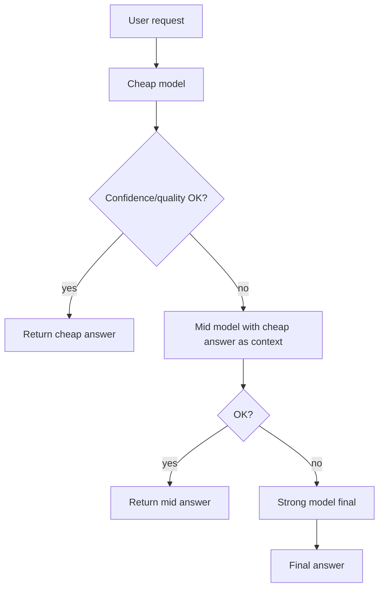

### 语义

```text
从便宜模型开始，不满足条件才升级。
```

### 适用

```text
高 QPS 场景
预算强约束
客服/简单问答/内部工具
```

---

## 4.12 Flow 9：`dual_path_tool_acting_v1`

### 流程

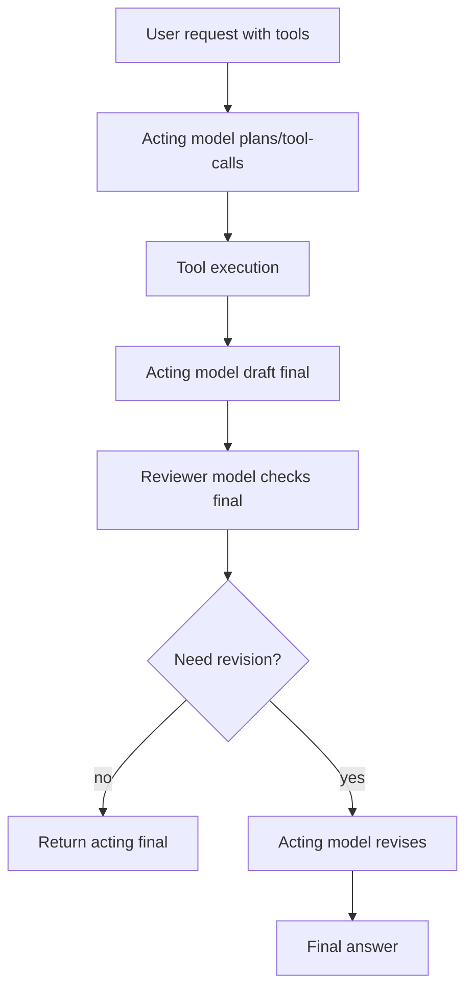

### 语义

```text
只有 acting model 能调用工具。
reviewer 不能直接调用工具，只能指出问题。
最终仍由 acting model 输出，保证工具调用链一致。
```

### 适用

```text
agent 工作流
需要工具调用一致性
需要 reviewer 但不想让多个模型乱发 tool_call
```

---

## 4.13 Flow 10：`shadow_evaluation_v1`

### 流程

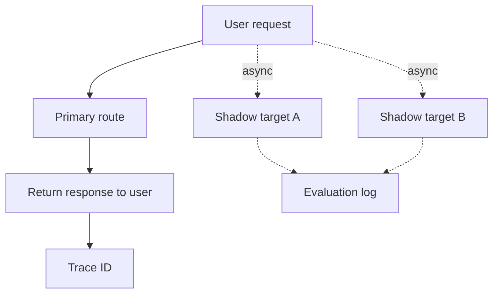

### 语义

```text
主响应不依赖 shadow。
shadow 用于评估新模型、训练路由策略、比较成本/延迟/质量。
```

### 适用

```text
新模型上线前评估
smart router 数据采集
A/B 之前的 shadow 流量
```

## 4.14 MoV 与 streaming 的关系

推荐规则：

| 策略 | Streaming 支持 |
|---|---|
| `direct_alias` | 支持原样透传 |
| `smart_router` | 支持，选定单 target 后透传 |
| `parallel_synthesize` | 默认不支持，除非 aggregator 阶段才 stream |
| `parallel_judge_select` | 默认不支持 |
| `verify_then_escalate` | 不建议 stream；因为 verifier 前不能确定最终答案 |
| `shadow_evaluation` | 主路由可 stream，shadow 异步执行 |

## 4.15 MoV trace

每次多模型执行应记录：

```json
{
  "flow": "parallel_synthesize_v1",
  "references": [
    {"target": "cheap_fast", "status": 200, "latency_ms": 1800},
    {"target": "reasoning_strong", "status": 200, "latency_ms": 6200}
  ],
  "aggregator": {"target": "openai_smart", "status": 200, "latency_ms": 4100},
  "partial_references_used": true,
  "total_extra_cost_usd": 0.043
}
```


---

# 05. 配置文件与请求级 Override 合约

## 5.1 结论

XRouter 必须同时支持：

```text
配置文件：定义默认策略、候选集、权重、能力、预算、缓存开关
请求级 override：定义本次调用的路由意图、候选限制、缓存 hint、是否强制/关闭多模型
```

但请求级 override 不能绕过配置边界。

## 5.2 配置结构总览

推荐配置分区：

```yaml
version: 3
providers: {}
targets: {}
routes: {}
smart_policies: {}
mov_flows: {}
prefix_cache: {}
observability: {}
tenants: {}
```

## 5.3 Provider 配置

```yaml
providers:
  openai:
    kind: openai
    base_url: https://api.openai.com/v1
    api_key_env: OPENAI_API_KEY
    supports:
      chat_completions: true
      responses: true

  openrouter:
    kind: openai_compatible
    base_url: https://openrouter.ai/api/v1
    api_key_env: OPENROUTER_API_KEY
    default_headers:
      HTTP-Referer: https://xrouter.local
      X-OpenRouter-Title: XRouter
    supports:
      chat_completions: true
      responses: false
```

## 5.4 Target 配置

```yaml
targets:
  openai_fast:
    provider: openai
    upstream_model: gpt-4.1-mini
    capabilities:
      tools: true
      vision: true
      json_schema: true
      context_window: 1048576
      prompt_cache: true
    prices:
      input_per_1m: 0.40
      output_per_1m: 1.60
    scores:
      quality: 0.78
      code: 0.72
      reasoning: 0.70
      tool_call: 0.82
      json: 0.85

  or_sonnet:
    provider: openrouter
    upstream_model: anthropic/claude-sonnet-4
    capabilities:
      tools: true
      vision: true
      json_schema: true
      context_window: 200000
      prompt_cache: true
    scores:
      quality: 0.90
      code: 0.88
      reasoning: 0.86
```

## 5.5 Route 配置

### Direct alias

```yaml
routes:
  gpt-4o-mini:
    kind: direct_alias
    target: openai_fast
    no_prompt_rewrite: true
```

### Smart router

```yaml
routes:
  xrouter/auto:
    kind: smart_router
    policy: smart_balanced_v1
    allowed_request_overrides:
      candidates: true
      objective: true
      cache: true
      multi_model: true
```

### Prefix route

```yaml
prefix_routes:
  xrouter/auto/:
    kind: smart_router
    policy_from_suffix: true

  xrouter/mov/:
    kind: mov
    flow_from_suffix: true
```

### MoV route

```yaml
routes:
  xrouter/mov/parallel-synth:
    kind: mov
    flow: parallel_synthesize_v1
    activation:
      mode: auto
      complexity_gte: 0.78
      sample_rate: 1.0
```

## 5.6 Smart policy 配置

```yaml
smart_policies:
  smart_balanced_v1:
    objective: balanced
    candidates: [openai_fast, openai_smart, or_sonnet, cheap_fast]
    hard_filters:
      enforce_context_window: true
      enforce_tools: true
      enforce_vision: true
      enforce_json_schema: true
    prefix_cache:
      enabled: true
      weight: 0.22
    rules:
      enabled: true
    judge:
      enabled: false
      target: judge_small
      timeout_ms: 800
      call_when:
        complexity_gte: 0.70
        ambiguity_gte: 0.55
    weights:
      quality: 0.30
      cost: 0.15
      latency: 0.15
      reliability: 0.10
      cache: 0.22
      capability: 0.05
      sticky: 0.03
```

## 5.7 MoV flow 配置

```yaml
mov_flows:
  parallel_synthesize_v1:
    type: parallel_synthesize
    references: [cheap_fast, or_sonnet, openai_fast]
    aggregator: openai_smart
    allow_partial_references: true
    reference_timeout_ms: 12000
    max_reference_tokens: 800

  verify_then_escalate_v1:
    type: verify_then_escalate
    primary_policy: smart_cost_v1
    verifier: judge_small
    pass_threshold: 0.78
    escalate_to_flow: parallel_synthesize_v1
```

## 5.8 请求级 override

请求体：

```json
{
  "model": "xrouter/auto",
  "messages": [
    {"role": "user", "content": "Debug this Go data race."}
  ],
  "xrouter": {
    "objective": "quality",
    "candidates": ["openai_smart", "or_sonnet"],
    "multi_model": "auto",
    "cache": {
      "enabled": true,
      "prefix_hint": "repo:acme/backend:main"
    },
    "judge": {
      "enabled": true,
      "max_overhead_ms": 1200
    },
    "trace": "verbose"
  }
}
```

Header 等价形式：

```text
x-xrouter-route: xrouter/auto/code
x-xrouter-objective: quality
x-xrouter-candidates: openai_smart,or_sonnet
x-xrouter-multi-model: never|auto|always
x-xrouter-cache-enabled: true
x-xrouter-cache-prefix-hint: repo:acme/backend:main
x-xrouter-trace: verbose
```

## 5.9 Override 合并规则

优先级：

```text
system policy > tenant policy > request override > route config > global defaults
```

示例：

```text
tenant 禁止 openrouter，则 request candidates 里即使传 or_sonnet 也要过滤。
route multi_model=never 且 allow_override=false，则 request 不能强制 always。
request objective=cost 只能修改权重，不得绕过 tools/vision/context hard gates。
```

## 5.10 响应 trace 字段

建议响应里可选加：

```json
{
  "xrouter": {
    "trace_id": "xr_...",
    "incoming_model": "xrouter/auto",
    "route_kind": "smart_router",
    "policy": "smart_balanced_v1",
    "selected_target": "or_sonnet",
    "fallback_chain": ["openai_smart", "cheap_fast"],
    "scores": {
      "or_sonnet": 0.872,
      "openai_smart": 0.846
    },
    "cache": {
      "prefix_hash": "sha256:...",
      "affinity_target": "or_sonnet",
      "score": 0.74
    }
  }
}
```

默认不返回 verbose trace，除非：

```text
请求 xrouter.trace=verbose
或租户开启 debug
或 dry_run=true
```


---

# 06. 默认权重、阈值与决策矩阵

## 6.1 结论

算法必须可调，但第一版需要一组合理默认值。推荐定义三类 smart policy：

```text
smart_balanced_v1
smart_cost_v1
smart_quality_v1
```

## 6.2 默认权重

| 权重 | balanced | cost | quality | latency |
|---|---:|---:|---:|---:|
| quality | 0.30 | 0.18 | 0.48 | 0.24 |
| cost | 0.15 | 0.34 | 0.05 | 0.10 |
| latency | 0.15 | 0.16 | 0.08 | 0.34 |
| reliability | 0.10 | 0.10 | 0.12 | 0.12 |
| cache | 0.22 | 0.16 | 0.18 | 0.14 |
| capability | 0.05 | 0.04 | 0.06 | 0.04 |
| sticky | 0.03 | 0.02 | 0.03 | 0.02 |

## 6.3 复杂度估算

推荐先用启发式：

```text
complexity = clamp(
    0.18 * long_context_signal
  + 0.18 * code_signal
  + 0.16 * reasoning_signal
  + 0.12 * tool_signal
  + 0.10 * json_schema_signal
  + 0.10 * planning_signal
  + 0.08 * math_signal
  + 0.08 * risk_signal,
  0, 1
)
```

信号取值 `[0,1]`。

第一版不要过度依赖 judge model，因为 judge 本身引入延迟、成本、失败模式。

## 6.4 多模型触发阈值

| 场景 | 推荐策略 |
|---|---|
| 简单聊天 / 改写 | `multi_model=never` |
| 普通代码解释 | `smart_router` 单模型 |
| debug / patch / 架构设计 | `smart_router`，复杂度高时 `verify_then_escalate` |
| 长上下文仓库任务 | `smart_router + prefix_cache`，必要时 `map_reduce_specialists` |
| 高价值交付物 | `propose_critique_revise` 或 `parallel_synthesize` |
| 新模型评估 | `shadow_evaluation` |

默认阈值：

```yaml
escalation:
  smart_to_verify: 0.68
  smart_to_parallel_synth: 0.82
  verifier_fail_threshold: 0.78
  judge_call_complexity: 0.70
```

## 6.5 Prefix cache 权重建议

| prompt_tokens_est | cache weight 建议 |
|---:|---:|
| `< 1k` | 0.00 - 0.05 |
| `1k - 8k` | 0.08 - 0.16 |
| `8k - 32k` | 0.18 - 0.28 |
| `> 32k` | 0.25 - 0.35 |

理由：短 prompt 的缓存收益很低，不应为了缓存牺牲模型质量或延迟。

## 6.6 裁判模型调用条件

推荐：

```text
只有在以下任一条件满足时调用 judge：
1. top-2 target 分差小于 0.05
2. complexity >= 0.70
3. request 明确 xrouter.judge.enabled=true
4. policy 是 quality 且 budget 允许
```

不要每次 smart router 都调用 judge。

## 6.7 决策矩阵

| incoming model ID | 配置策略 | 运行时行为 |
|---|---|---|
| `gpt-4o-mini` | `direct_alias` | 直接映射到指定 target，不改 prompt |
| `xrouter/auto` | `smart_balanced_v1` | 单模型选择，默认启用 prefix cache BK |
| `xrouter/auto/code` | `smart_code_v1` | 代码任务候选集 + 代码权重更高 |
| `xrouter/auto/cost` | `smart_cost_v1` | 成本权重更高，必要时 fallback |
| `xrouter/mov/parallel-synth` | `parallel_synthesize_v1` | 多 reference + aggregator |
| `xrouter/mov/verify-escalate` | `verify_then_escalate_v1` | 先单模型，失败再升级 |
| `xrouter/mov/shadow` | `shadow_evaluation_v1` | 主响应直接返回，旁路评估 |

## 6.8 dry-run 输出

调参阶段必须支持 dry-run：

```json
{
  "model": "xrouter/auto",
  "messages": [{"role": "user", "content": "Explain this panic stacktrace..."}],
  "xrouter": {"dry_run": true, "trace": "verbose"}
}
```

返回：

```json
{
  "object": "xrouter.route_decision",
  "route_kind": "smart_router",
  "selected_target": "openai_smart",
  "scores": {
    "openai_smart": 0.881,
    "or_sonnet": 0.852,
    "cheap_fast": 0.603
  },
  "features": {
    "code_signal": 0.92,
    "complexity": 0.76,
    "prompt_tokens_est": 4200
  },
  "cache": {
    "enabled": true,
    "best_affinity_target": "or_sonnet",
    "score": 0.41
  },
  "reason": "code task; openai_smart won by quality+tool_call despite or_sonnet cache affinity"
}
```


---

# 07. 后续 Go 开发边界

## 7.1 结论

在进入 Go 开发前，应先冻结以下模块边界。否则实现会变成散落在 handler 里的 if/else。

## 7.2 核心模块

```text
StrategyResolver
FeatureExtractor
PrefixCacheStore
SmartRouterEngine
MoVExecutor
ProviderInvoker
RouteTraceRecorder
MetricsStore
```

## 7.3 模块职责

| 模块 | 职责 |
|---|---|
| `StrategyResolver` | 根据 model ID、配置、请求 override 解析 route kind 和策略配置 |
| `FeatureExtractor` | 从 OpenAI request 提取 tokens、tools、vision、code/math/planning signals、prefix hash |
| `PrefixCacheStore` | BK lookup/update；第一版内存，后续 Redis/Postgres |
| `SmartRouterEngine` | hard filter + classifier + judge + weighted scoring，输出一个 target |
| `MoVExecutor` | 执行 10 类多模型 flow；处理并行、串行、聚合、超时、partial |
| `ProviderInvoker` | 调 OpenAI/OpenRouter/OpenAI-compatible provider；处理 streaming/passthrough/fallback |
| `RouteTraceRecorder` | 生成 trace，支持 dry-run 和 debug response |
| `MetricsStore` | latency、error、cost、cache usage、judge accuracy、shadow eval 数据 |

## 7.4 Go 实现建议

### Go

当前实现已经采用单 Go 代码路径：

```text
net/http
goroutine + context timeout 执行并行 MoV / race
内存 prefix BK，后续可替换 Redis/Postgres
单 binary 部署
接口清晰，便于嵌入企业服务
```

## 7.5 不应在下一步直接做的事

```text
不要一开始就做复杂在线学习
不要一开始就让 judge 改写用户 prompt
不要把 response cache 和 prefix cache BK 混在一起
不要把 smart_router 和 MoV 写成同一个函数
不要默认所有 xrouter/auto 都多模型
```

## 7.6 下一步开发顺序

推荐顺序：

```text
1. StrategyResolver：先把 model ID -> strategy 做正确
2. DirectAlias：固定映射路径做到完全稳定
3. SmartRouterEngine v1：hard filter + weighted score + dry-run
4. PrefixCacheStore v1：hash_only + exact lookup + update
5. JudgeRouter v1：schema-constrained judge classifier
6. MoVExecutor v1：先实现 3 个 flow
   - parallel_synthesize
   - verify_then_escalate
   - shadow_evaluation
7. 再实现剩余 MoV flows
```

## 7.7 第一批必须测试的用例

| 用例 | 期望 |
|---|---|
| 固定 model ID | exact route 优先，prompt 原样透传 |
| prefix model ID | longest prefix 生效 |
| unknown model | 默认 reject；显式 `passthrough_openai` / `passthrough_openrouter` 时按指定 provider 透传 |
| tools 请求 | 不支持 tools 的 target 被过滤 |
| 长上下文 + cache BK 命中 | cache affinity 提高目标分数 |
| judge timeout | 回退到 weighted router |
| multi_model=never | 绝不触发 MoV |
| multi_model=auto 且复杂度低 | 走单模型 |
| multi_model=auto 且复杂度高 | 才升级 MoV |
| shadow | 不阻塞主响应 |
